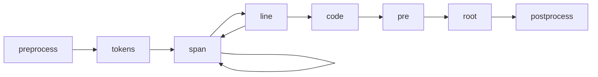

# 转换器

Shiki 使用了 [`hast`](https://github.com/syntax-tree/hast)，这是一种用于 HTML 的 AST 格式，用来处理结果并生成 HTML。

你可以使用自己的 `transformers` 修改 hast 树来自定义生成的 HTML；你也可以传递自定义函数来修改不同类型节点的树，例如：

```ts twoslash
import { codeToHtml } from 'shiki'

const code = await codeToHtml('foo\bar', {
  lang: 'js',
  theme: 'vitesse-light',
  transformers: [
    {
      code(node) {
        this.addClassToHast(node, 'language-js')
      },
      line(node, line) {
        node.properties['data-line'] = line
        if ([1, 3, 4].includes(line))
          this.addClassToHast(node, 'highlight')
      },
      span(node, line, col) {
        node.properties['data-token'] = `token:${line}:${col}`
      },
    },
  ]
})
```

我们也提供了一些常用的转换器供你使用，查看 [`shiki-transforms`](/packages/transformers) 了解更多。

## 转换器钩子



- `preprocess` - 在代码标签化之前调用，你可以使用它在代码渲染为标签之前进行修改。
- `tokens` - 在代码标签化之后调用，你可以使用它来修改标签。
- `span` - 对每个 `<span>` 标签及每个标记都调用。
- `line` - 对每行 `<span>` 标签调用。
- `code` - 对每个 `<code>` 标签调用，这将会包裹所有的行。
- `pre` - 对每个 `<pre>` 标签调用，并将其包裹在 `<code> `标签中。
- `root` - HAST 树的根，通常情况下只有 `<pre>` 一个子标签。
- `postprocess` - 在 HTML 生成后调用，用来修改最终输出，在 `codeToHast` 中不会被调用。

## 元

转换器还可以访问 [受支持的集成](/guide/install#integrations) 中的 Markdown `meta` 字符串。

<!-- eslint-skip -->

````markdown
<!-- [!code word:meta=here] -->
```html meta=here
````

You can access the raw meta using:

<!-- eslint-skip -->

```ts
options.meta
// => { meta: 'here', __raw: 'meta=here' }
```
